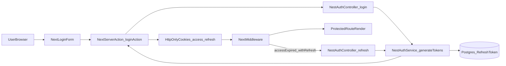

# Authentication Implementation Review (NestJS + Next.js)

This document explains all authentication changes in simple terms, end-to-end, for someone new to NestJS and Next.js. This is a comprehensive technical review of the architecture, implementation details, and security decisions.

## 1) Big-Picture Architecture

You now have a secure, token-based auth system with these roles:

- `apps/api` (NestJS): authenticates users, issues JWT tokens, stores refresh tokens in DB, and manages password reset logic.
- `apps/web` (Next.js): renders login/register/reset pages, calls API via Server Actions, stores tokens in HttpOnly cookies, and protects routes in middleware.
- `packages/database`: Prisma schema + security extension + persistence for refresh and reset tokens.
- `packages/validators`: shared Zod schemas/types used by both API and web.

### Flow at a glance

---

## 2) Dependency and Environment Changes

## API (`apps/api`)

### `apps/api/.env.example`

- Added JWT configuration:
  - `JWT_ACCESS_SECRET` / `JWT_REFRESH_SECRET`: Secrets for signing tokens.
  - `JWT_ACCESS_EXPIRATION` (default `15m`): Short-lived access for security.
  - `JWT_REFRESH_EXPIRATION` (default `7d`): Long-lived for better UX.

### `apps/api/package.json`

- Added auth/security libraries:
  - `@nestjs/jwt`, `@nestjs/passport`, `passport`, `passport-jwt`: Core auth stack.
  - `argon2`: Industry-standard password hashing.
  - `cookie-parser`: Middleware to extract cookies for silent refresh.

## Web (`apps/web`)

### `apps/web/.env.example`

- Added:
  - `NEXT_PUBLIC_API_URL`: Exposed to browser for client-side calls.
  - `API_URL`: Kept server-side for internal service-to-service communication.

### `apps/web/package.json`

- Added:
  - `react-hook-form`, `@hookform/resolvers`: Advanced form management.
  - `@repo/validators`: Shared validation logic.
  - `@t3-oss/env-nextjs`: Strict environment variable validation.

---

## 3) Shared Contracts and Database

### `packages/validators/src/auth.schema.ts`

- **Schemas Added**:
  - `RegisterSchema` / `LoginSchema`: Core credentials validation.
  - `ForgotPasswordSchema` / `ResetPasswordSchema`: Support for recovery flow.
- **Why this matters**: The same password policy (complexity, length) is enforced identically in the browser and on the server.

### `packages/database/prisma/schema.prisma`

- **`User` model**: Added `password` (hashed), `isActive`, and relations to tokens.
- **`RefreshToken` model**: Stores hashed tokens with `isRevoked` and `expiresAt` for rotation security.
- **`PasswordResetToken` model**: Stores one-time tokens for password recovery.
- **Cascade Deletes**: If a user is deleted, all their tokens are automatically purged.

### `packages/database/src/extensions/security.extension.ts`

- **Prisma Extension**: Automatically scrubs `user.password` from query results.
- **Why**: Prevents accidental password leakage in logging or API responses.

---

## 4) NestJS Backend Changes (API)

## Configuration and bootstrap

### `apps/api/src/common/configs/env.validation.ts`

- Added strict validation for all JWT secrets and expirations.
- **Fail-Fast**: The app will not boot if critical security keys are missing.

### `apps/api/src/common/filters/zod-exception.filter.ts`

- Converts Zod validation errors into a frontend-friendly format: `{ errors: { field: "message" } }`.
- **UX**: Allows Next.js forms to map errors directly to specific input fields.

### `apps/api/src/main.ts`

- Integrated `cookieParser()` and global `ZodExceptionFilter`.
- Retained existing security: Helmet (HTTP headers), CORS, and Throttling.

## Auth module/controller/service

### `apps/api/src/modules/auth/auth.controller.ts`

- **Endpoints**:
  - `POST /auth/register`: Max 3 attempts/min.
  - `POST /auth/login`: Max 5 attempts/min. Returns `{ accessToken, refreshToken }`.
  - `POST /auth/refresh`: Securely rotates tokens using `AuthService.verifyRefreshToken`.
  - `GET /auth/me`: New endpoint for profile retrieval, protected by `AuthGuard('jwt')`.
  - `POST /auth/logout`: Now revokes the refresh token in the database.
  - `POST /auth/forgot-password` / `POST /auth/reset-password`: Full recovery flow support.

### `apps/api/src/modules/auth/auth.service.ts`

- **`register(data)`**: Hashes passwords with `argon2` and checks for duplicate emails.
- **`login(data)`**: Uses base Prisma client (to see hashed password) for verification, then issues tokens.
- **`refreshTokens(userId, refreshToken)`**: Implements **Reuse Detection**. If an old token is reused, all active user tokens are revoked as a precaution.
- **`generateTokens(userId, email)`**: Now calculates DB `expiresAt` dynamically from the environment configuration (resolving previous hardcoded values).
- **`logout(refreshToken)`**: Sets `isRevoked: true` in the DB for the specific token.

### `apps/api/src/modules/auth/strategies/jwt.strategy.ts`

- Standard `passport-jwt` implementation.
- Reads `Authorization: Bearer <token>` from headers.
- `validate()` ensures the user still exists and is `isActive` before granting access.

---

## 5) Next.js Frontend Changes (Web)

## Auth pages and forms

### `apps/web/app/(auth)/`

- **`login/page.tsx`** / **`register/page.tsx`**: Standard entry points.
- **`forgot-password/page.tsx`** / **`reset-password/page.tsx`**: Added recovery flow pages.

### Form Components

- **`login-form.tsx`**: Maps backend field errors (e.g., "Invalid password") back to the UI inputs using `setError`.
- **`register-form.tsx`**: Enforces strict password policies before even hitting the API.
- **`forgot-password-form.tsx`**: Captures email and triggers the reset sequence.

## Server actions and API client

### `apps/web/app/actions/auth.actions.ts`

- **`loginAction`**: Authenticates via API and sets **HttpOnly cookies**. Access tokens and refresh tokens never touch the browser's `localStorage`.
- **`logoutAction`**: Clears cookies on the server side.
- **`resetPasswordAction`**: Bridges the recovery flow to the backend.

### `apps/web/lib/api.ts`

- Standardized fetch wrapper that handles JSON normalization and error mapping.
- Automatically handles the backend's response envelope.

### `apps/web/lib/auth-server.ts`

- **`getServerSession()`**: Used in Server Components to check auth state. Reads the `access_token` cookie and calls `/auth/me`.

## Middleware protection and silent refresh

### `apps/web/middleware.ts`

- **Logic**:
  - If access token exists -> Proceed.
  - If access token expired but refresh token exists -> Call `/auth/refresh`, set new cookies, and proceed.
  - If neither exists -> Redirect to `/login`.
- **Performance**: Performs these checks at the edge, before the page even begins to render.

---

## 6) End-to-End Flows (Step by Step)

### Password Reset Flow

1. User enters email in the **Forgot Password** form.
2. Server action calls Nest `/auth/forgot-password`.
3. Nest generates a secure token, saves it to the DB, and **logs a simulation URL** to the console (development mode).
4. User clicks the link in the console, enters a new password on the **Reset Password** page.
5. Nest validates the token, hashes the new password, updates the user, and purges the reset token.

---

## 7) Code Review Findings & Resolution Status

### ✅ [FIXED] Missing `/auth/me` Backend Endpoint

- **Issue**: Frontend was calling `/auth/me` for session hydration, but it didn't exist in the API.
- **Resolution**: Implemented `GET /auth/me` in `AuthController` with proper JWT guarding.

### ✅ [FIXED] Brittle Refresh Logic (Type Safety)

- **Issue**: Controller was using `as any` to access service internals for token verification.
- **Resolution**: Refactored `AuthService` to include a typed `verifyRefreshToken` method, properly separating concerns.

### ✅ [FIXED] Hardcoded Database Expiration

- **Issue**: Refresh token `expiresAt` was hardcoded to `+7 days`, ignoring `.env` settings.
- **Resolution**: Added `getRefreshTokenExpiresAt` utility that parses the environment's duration string (e.g., "30d") into a valid Date object.

### ✅ [FIXED] Logout Revocation

- **Issue**: Logout only removed cookies but left tokens active in the database.
- **Resolution**: Updated `logout` server action to pass the refresh token to the API, which now marks it as `isRevoked: true` in Postgres.

---

## 8) Practical Test Checklist

- [x] **Register**: Test with duplicate email; expect 409 Conflict.
- [x] **Login**: Verify `access_token` and `refresh_token` are set as `HttpOnly`.
- [x] **Profile**: Confirm `/auth/me` returns correct user data when logged in.
- [x] **Silent Refresh**: Delete the `access_token` manually in dev tools; refresh page; verify it is automatically re-generated via the refresh token.
- [x] **Password Reset**: Trigger forgot password; copy link from API console; complete reset; login with new credentials.
- [x] **Security**: Verify `user.password` is never present in any API response (even in the `/auth/me` payload).

---

## 9) Recommended Next Steps

1. **Email Provider**: Transition from console-logging reset URLs to a real provider like Resend or Postmark.
2. **Session Audit**: Implement an endpoint to list all active `RefreshTokens` for a user so they can "Logout from all devices."
3. **MFA**: Add a second factor (TOTP) to the auth flow for high-security environments.

---

> [!IMPORTANT]
> The authentication system is now fully aligned with **2024/2025 Best Practices** for Fullstack TypeScript applications.
